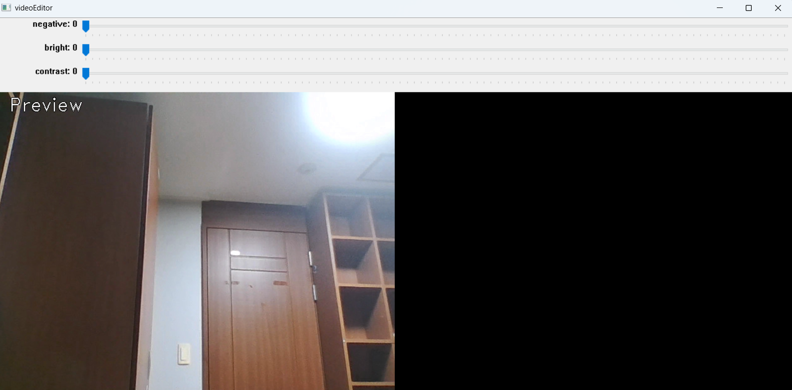
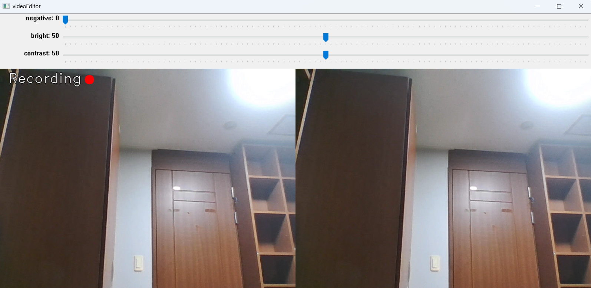
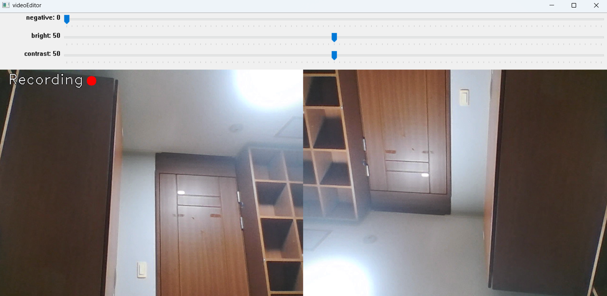
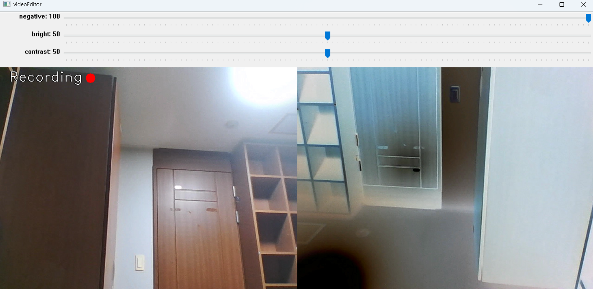
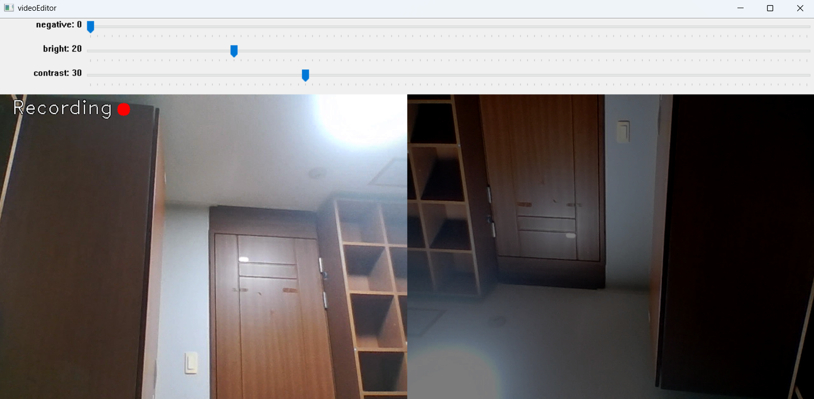
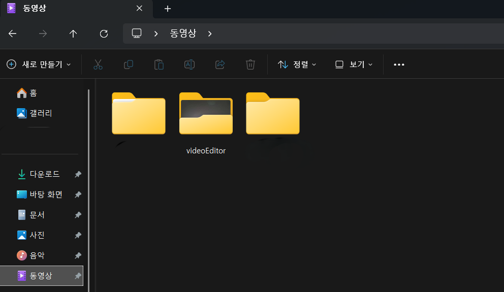

# videoEditor
---
## 주요 기능
* 상하좌우 반전
* 보색 필터
* 밝기, 대비 필터
---
## 사용법

녹화 시작 전 화면입니다. 왼쪽 화면은 원본 화면, 오른쪽 화면은 편집되어 저장될 화면입니다.  

스페이스바를 누르면 녹화가 시작되며 오른쪽 화면이 켜집니다.  

W, S 버튼을 눌러 상하 반전을, A, D 버튼을 눌러 좌우 반전을 적용할 수 있습니다.  

첫번째 트랙바는 보색의 정도를 조절할 수 있습니다.  

두번째, 세번째 트랙바를 조절하여 밝기와 대비를 조절할 수 있으며, 세 개의 트랙바를 동시에 조절하는 것 또한 가능합니다.
 
 
스페이스바를 다시 한 번 눌러 녹화를 종료합니다. 저장된 화면은 오른쪽 영상입니다.  

또한 ESC키를 누르면 프로그램이 종료됩니다.  

 
저장된 영상은 Videos\videoEditor에서 확인하실 수 있습니다.
